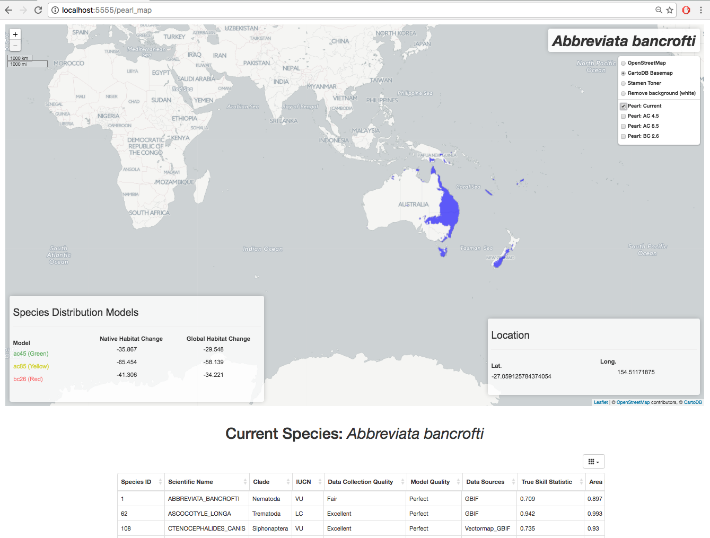
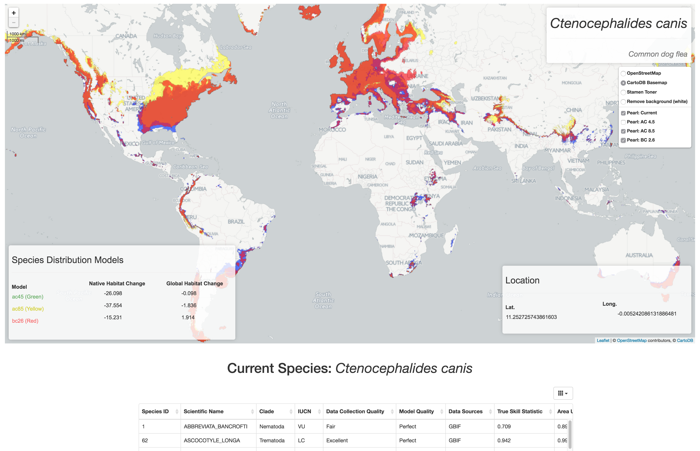

## 1. EWAIM: an Extensible Web App for Interactive Mapping

#### 1.1 Overview

**EWAIM-webapp** is a web mapping app that uses *Leaflet x D3 (Javascript)* on the frontend and *Flask x PostGreSQL* on the backend. In addition, we include a directory titled **EWAIM** that contains a Python package for some simple data analysis and utility functionality - used in the backend. The **EWAIM** package has *continuous testing* through Travis-CL. Users of this app (for now) need to run the *setup.py* file to make the EWAIM module (*EWAIM is imported and used in the main Flask app.py file*). Our future development includes building further data processing and analysis functions as well as **Species Distribution Model** functions in the EWAIM package focused on spatial, movement, and time series data.

**PEARL: using EWAIM to map projections of current and future distributions of species**

Species: *Abbreviata bancrofti*

Showing predicted changes in native and global habitat due to climate trends using three different distribution models (*green, yellow, and red*). Current distribution shown in **blue**.





#### 1.2 Research Application

EWAIM (the webapp as well as the package) will be extended for direct research applications with at least two large-scale research projects in the **Wayne Getz lab at UC Berkeley**. One will be for the *Israel Migratory Bird* project - a study that is collecting spatial data of bird movement (roughly 2 million points daily). The other direct application is for *PEARL: Parasite Extinction Assessment and Red-Listing* - a database of Species Distribution Models (predictions of presence / absence) of species of parasites currently and future projections based on climate change trends.

#### 1.3 Breakdown of Development

This interactive database website is a collaborative project from Zhongqi Miao and Oliver Muellerklein from the **Wayne Getz lab at UC Berkeley**. Oliver primarily developed the frontend components of this project - focusing on routes to pages, GET / POST events, processing data from Flask (backend) in the HTML and Javascript, and interacting with D3 x Leaflet. In addition, Oliver contributed to building the underlying structure and continuous integration of testing of the *EWAIM* package. Miao developed the backend capabilities with *SQL interactions with the database*, raster data preparation with *parallel tile functions* (**see raster_data_prep/ directory and associated README**), and data analysis / GIS functionality for spatial and time series data.           

## 2. Setup

#### 2.1 CLI Setup of EWAIM Module

```
    $ python3 setup.py install
    # And test (used for Travis-CL)
    $ python3 setup.py test
```

#### 2.2 Database Setup for PostGreSQL

Commands for using the database I uploaded:

```bash
  createdb tweets -T template_postgis
  gunzip -c tweets_db.gz | psql tweets
```

If you don't have `postgis` template, please do this first:

```bash
  createdb template_postgis
  psql template_postgis
  >>> create extension postgis;
  >>> create extension postgis_topology;
```

To install `postgresql` and `postgis`:

OSX:
```bash
  brew install postgresql postgis
```

## 3. Future Development

- [ ] Make data table CSV downloadable
- [ ] Allow users to upload their own data

#### 3.1 To Do (Oliver)

- [X] Make nav_layout.html for web app skeleton
- [X] Create Flask layout for maps
- [X] Create Flask layout for data analysis results etc
- [ ] Pick data based on user event (local CSV Carbon vs CSV Twitter)
- [ ] Make front page to select data (have world map background)
- [ ] From selected data, render Carbon map
- [X] Make clickable / selectable heatmap layer - users can select different variables / layers for mapping
- [X] ... heatmap will be directly on map (all frontend), make it able to accept backend data

```
    # Turn tif into tiles for plotting (after test() turn grd into tif)
    $ gdal2tiles.py -z 1-6 -w none tif/ABBREVIATA\ BANCROFTI\ current.tif ../../../pearl-tiles/abba_curr
```

#### 3.2 To Do (Miao)

- [ ] Assume frontend passes back 'use postgres' - make db connections
- [X] Use Geo-Alch
- [ ] DATASHADER (Not going to be done now)
- [ ] Create GIS utility functions
- [ ] Create shapefile utility functions
    - [X] Functions importing shapefiles into python
    - [ ] Functions importing imported shapefiles into database
    - [X] Importing Pearl fliles
- [ ] Create raster utility functions
    - [ ] Importing rasters into databases
    - [ ] Creating rasters from databases
    - [X] Make tiling maps from the rasters
- [ ] Data analysis utilities

<hr>  

## 4. Misc.

#### 4.1 Data Analysis Methods

* **Kerneley Density Estimation (KDE):** A non-parameteric density estimator

* **Gaussian Mixture Model (GMM):** A parametric probability density function represented as a weighted sum of Gaussian component densities

*More to come...*
